```{r setup, include=FALSE}
knitr::opts_chunk$set(echo = FALSE)
```
# 1.0 Critique of Visualization

The original visualization can be seen below:

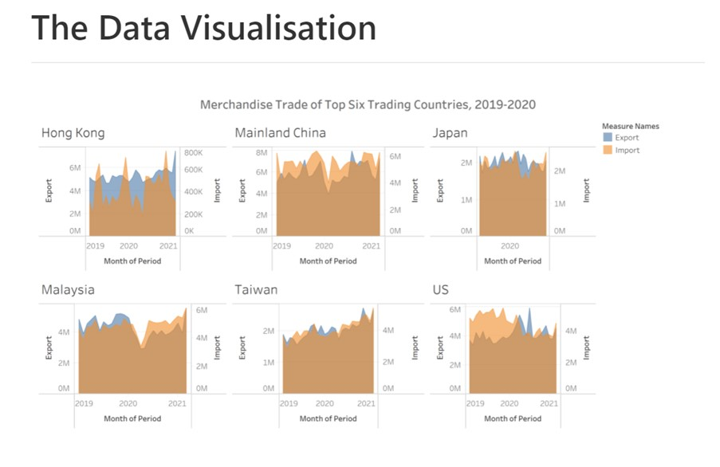

## 1.1 Clarity
* The title of the graph does not convey the intent of the graph. The graph trying to compare merchandise trade data of top six trading countries from 2009 to 2020. However, the original title stays on the description of the data and does not drive the messages of the major observation of the graph and does not have sub-title to explain the key words.

* X-axis is unclear. The title of this graph said, “Merchandise Trade of Top Six Countries, 2009-2020”. But we can observe that the X-axis still have the data from 2021. Besides X axis label use” Month of period” but there are no tick marks or label show the months.

* The unit of Y-axis is not uniform. Some country uses million and some uses thousand make it hard to do comparison.

* The Area chart is used, which is meaningless because the shaded area does not have means. Besides putting import and export in the same chart make is hard to identify the trends.

## 1.2 Aesthetic

* Tick marks not been used for both X and Y-axis.

* Put six countries one as an individual part is a good design to show the comparison and the part of each country is too small to intent more detail. And Repeated labels for each country is unnecessary.

* The font of the title is smaller than the font of the label.

# 2.0 Alternative Design 

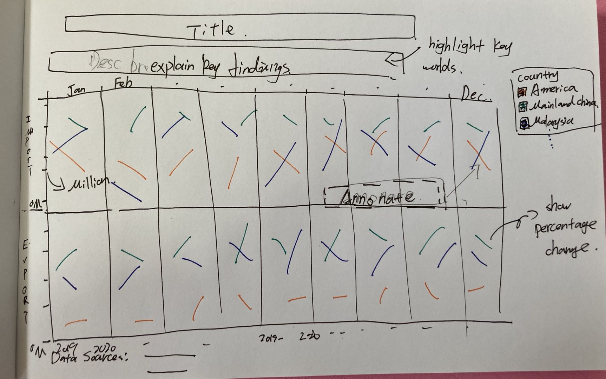

## 2.1 Clarity

*  Add explanation to the main findings. Adjust Y-axis unit of data to million dollars and separate import and export to two different charts make it easier to compare the trend.

*  Use Month to separate the charts inside of countries. Enable the reader to compare the trend between different countries in the same period of 2019 and 2020 and identify the overall rank.

* Add tooltip to show the percentage of change and annotate let reader identify the key findings.


## 2.2 Aesthetic

*  Add tick marks to Y-axis.

* Use color highlight the main countries want to show to the readers and to show the increase and decrease percentage. 


# 3.0 Proposed Visualisation

Please view the visualisation on Tableau Public [here](https://public.tableau.com/app/profile/qinyu.wang/viz/DataVizMakeover1_16223598749290/Dashboard1)

## 3.1 Data Preparation

First select the data we used from data source. The original number unit of America import and export data are million dollars. Converting it into thousand dollars by using “Paste Special-operation-multiply”.

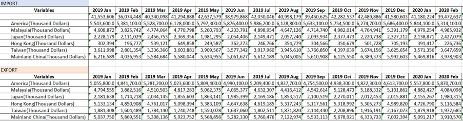
Then, reformat data we used into time series format and rename countries and adjust data retention to integer.

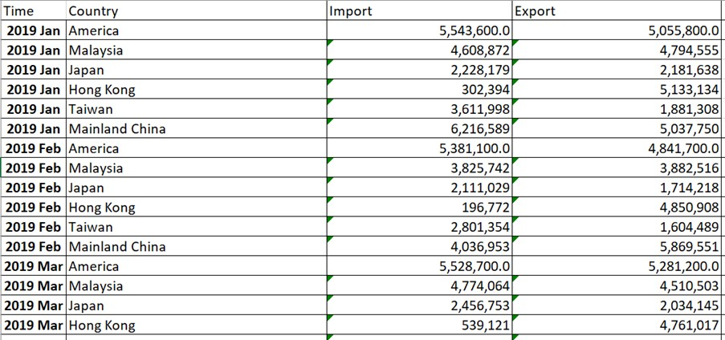{width=65%}

## 3.2 Data Visualization
1. Import into Tableau

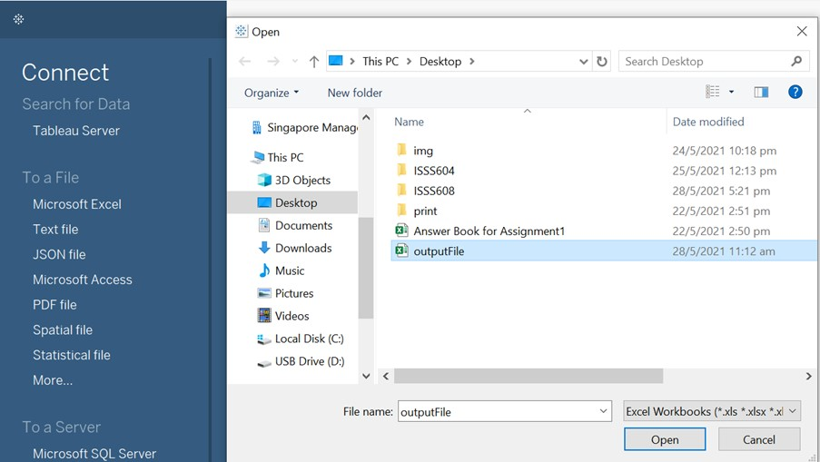{width=65%}

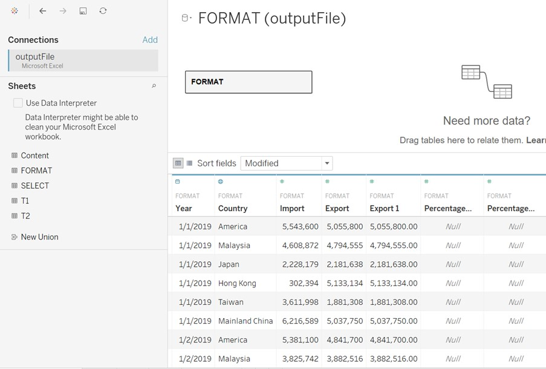{width=65%}

2.Change data type.
Change ‘Time’ data type from string to Date.

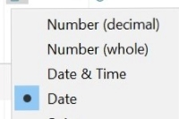{width=50%}

3. Create line chart
Drag [Time] and [Import] to Columns and Rows respectively. Click “+” mark on [Time] and add MONTH to Columns. Then adjust the order of YEAR and MONTH For export line chart, drag [Export] to Rows.
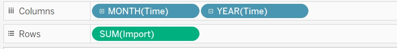{width=80%}
4. Apply colour
Drag [Country] to colour, adjusting colours and choose brighter to highlight America, Mainland China, Malaysia and Taiwan. 

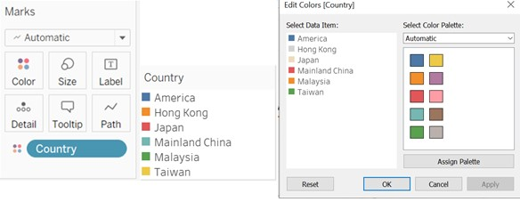

5. Update view
Update view from ‘Standard’ to ‘Entire View’.

6. Reformat MONTH and YEAR labels
Click the triangle behand MONTH, choose Format. Update Date from Automatic to Abbreviation. Update YEAR to two-digital through same method.

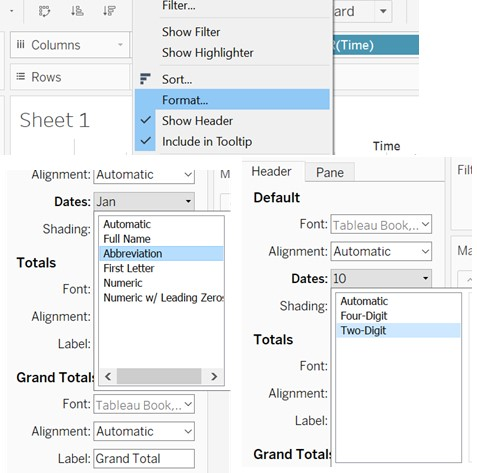{width=50%}

7. Update Tooltip
First create increase and decrease fields through: Analysis-Create Calculated Field and the code shows below:

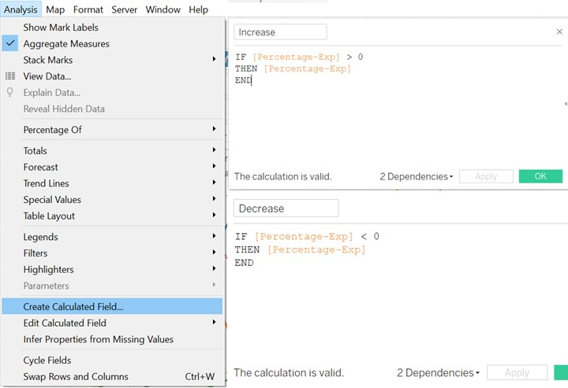{width=65%}

Adjust data to percentage format with one decimal places.

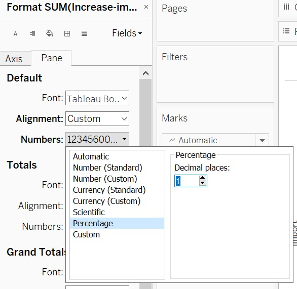{width=65%}
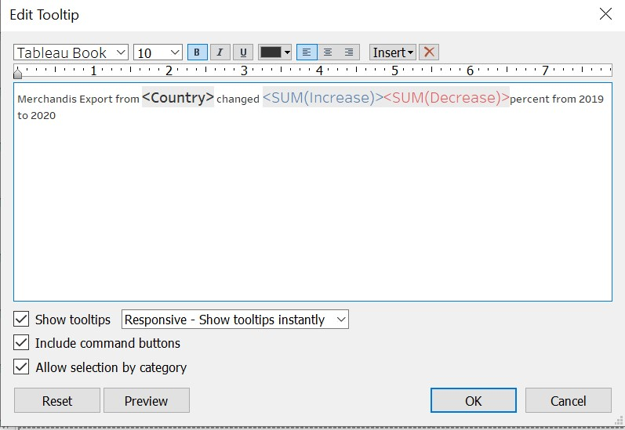{width=65%}

8.Create Dashboard

* Add Title: "Merchandise Import and Export Trends of Six Top Countries，2019-2020"

* Add Explanation: "In general, American and Mainland China are two main market for both import and export in 2019 and 2020.For import,compared with the same period in 2019, American shows a overall decrease trend while Taiwan has an increase trend.And for export, a clear decrease trend showed in Malaysia with highest -42.1% decrease."

* Add sheets "IMPORT" and "EXPORT" to Dashboard.

* Adjust Size to "Automatic".

* Add Data Source at the bottle of the Dashboard.

The final graph shows below:

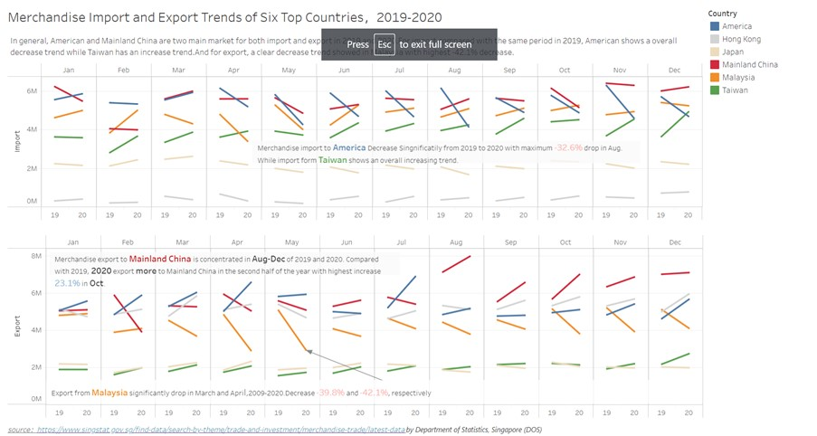

# 5.0 Derived Insights

* In general, American and Mainland China are two main market for both import and export in 2019 and 2020. Taiwan ranks higher as an import market instead of export and Hong Kong, on the contrary, more important as an export market.

* For import, compared with the same period in 2019, American shows a overall decrease trend with maximum -32.6% drop in Aug. While import form Taiwan shows an overall increasing trend.

* For export, a clear decrease trend showed in Malaysia with highest -42.1% decrease. Merchandise export to Mainland China is concentrated in Aug-Dec of 2019 and 2020. Compared with 2019, 2020 export more to Mainland China in the second half of the year with highest increase 23.1% in Oct.


