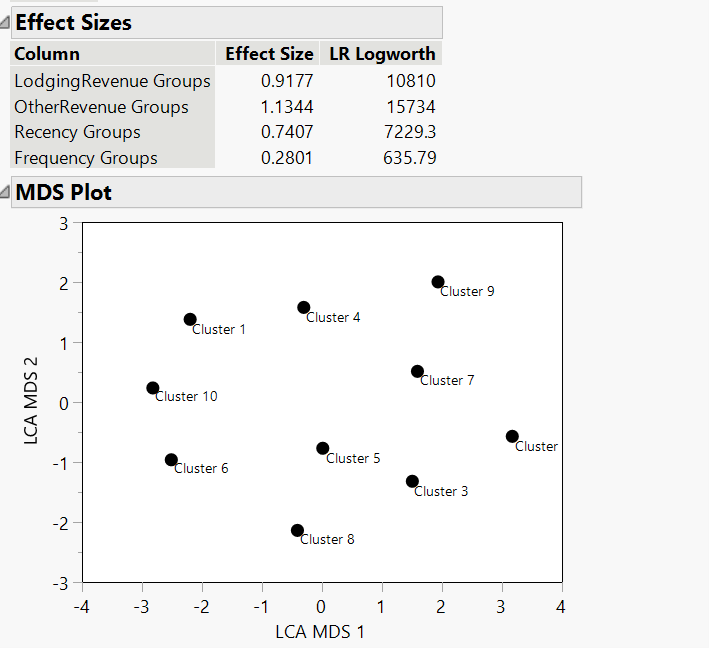

```{r setup, include=FALSE}
knitr::opts_chunk$set(echo = FALSE)
```

# 1. OVERVIEW

Products and service today are more and more customer-specific instead of a ‘one-size-fits-all’ approach Customer segmentations are used in many industries. Segmentation allows businesses to make better use of their marketing budgets, demonstrate a better knowledge of your customers’ needs and wants and finally make profit. 

In this study, customer segmentation will be performed on a Europe four-star hotel customers dataset. Customers will be segmented based on RFM performance. Recency, Frequency, and Monetary (RFM) metrics are important indicators of a customer’s behaviours because frequency and monetary value affects a customer’s lifetime value, and recency affects retention, a measure of engagement.  The eventual goal is to provide recommendations to hotel to better understand their customers.

# 2. DATA PREPARATION

The dataset HotelCustomersDataset.tsv comprised of 31 variables and 83,591 observations. The data came from a four-star hotel located in Lisbon, Portugal, Europe during three years. 13 of 31 variables are Boolean variables which indicated customers special requirement (1 means Yes;0 means No).

Next in data cleaning, I identified several data issues and took steps to rectify these issues for more meaningful data analysis

Finally, the dataset was reduced by hided and excluded variables that were not used in this analysis.

## 2.1	Data Quality Issues Identified

### 2.1.1	Inaccurate Data Type

13 of 31 variables are Boolean variables which indicated customers special requirement (1 means Yes;0 means No). So those variables should be changed from “Numeric-Continuous” to “Numeric-Nominal”. First, I grouped those variables together then changed data type using “Standardize Columns Attributes”. I also found “Age” should be “Numeric-Ordinal” instead of “Character-Nominal”

{width=65%}

### 2.1.2 Data Summary

I checked data summary using “Column Viewer” under Col function. I observed some data issues. First, “Age” ranges from -11 to 122. Negative age does not make sense. Besides, “Age” has 3780 missing values.  Second, “AvergaLeadTime”,” DaySinceLastStay” and “DaySinceFirstStay” all have value -1. Refer to data description document, I found that -1 represents this customer never stay in the hotel.

{width=65%}

According to Age requirement for Hotel in Europe , customer who under 18 years old cannot stay in hotel alone. Hence, I will not take customers whose age under 18 and over 90 in to consider. Next, I selected those variables by using “Select Where” and removed them from the dataset for more meaningful analysis results.

{width=65%}

### 2.1.3	Missing Values

3779 missing values found in variable ‘Age’ and 1 missing value missed all 12 variables, Missing values accounted for < 1% of total. Hence, I hided and excluded those data from the dataset.

In addition, I observed that for the distributions of “DaysSinceCreation”, data from 1050 to 1100 is relative less than other groups. This may cause by potential missing values. Therefore, I hided and excluded this period from analysis.

{width=70%}

## 2.2 Clustering Variables Preparatio

I choose “DaySinceLastStay” for Recency; “LodgingRevenue” and “OtherRevenue” as Monetary Variables. “DaySinceLastStay” indicated that The numbers of days elapsed between the last day of the extraction and the customer’s last arrival data. Therefore, the smaller value is, the higher Recency this customer has. For Frequency, I count for how many records under same “NameHash” by using Summary under Table function. Change column “N row” into “Frequency”. Next, I joined this column to main table by using Update under Table function.

{width=70%}

# 3. CUSTOMER SEGMENTATION AND ANALYSIS

Figure 6 shows the correlations between clustering variables. I observed that the highest correlation is between LodgingRevenue and OtherRevenue (0.4554). None of final clustering variables correlation above |0.8|. Hence, we accept all variables for clustering later.


## 3.1 K-Means Clustering

Figure 7 illustrates the K-Means cluster of untransformed “LodgingRevenue”,” OtherRevenue”, “DaySinceLastStay” and “Frequency” variables scaled individually. Most of CCC values are negative because of high degrees of skewness and significant number of outliers. 

{width=50%}

Figure 8 shows the distributions of all clustering variables before transaction.


K-Means clustering is very sensitive to outliers. Hence, data transformation is important to reduce the skewness to resemble normal distribution for each variable in order to fix negative CCC problem.

Figure 8 shows the cluster comparison using the transformed values. Most of the CCC is positive excepted 3-Cluster,6-Cluster and 7-Cluster. JMP Pro 15 chosen the 4-cluster as the optimal choose. However, I observed that 8-clusters and 14-clusters have larger CCC. We also find most of the CCC are negative values from 3-clusters to 7-clusters, which means 4-Clusters is more sensitive to outliers. 8-clusters and 14-clusters can be better choice.

After compared the result of 8 and 14 clusters, we find that 14 clusters have relative larger values range between different clusters. For more meaningful analysis result, 8-Cluster is our final choice.

Figure 9 shows the cluster summary of K-Mean NCluster=8. Most of cluster count is distributed with values ranging from 13526 to 6758. Three of all clusters have relative less counts which around 1000. This cluster is saved, and a parallel graph is plotted for further analysis as shown in Figure 11 and Table 1 shows the summary of all 8 clusters. In general, it is hard to qualify unique feature of each cluster, especially for Recency, because of significant outliers.

{width=70%}

{width=70%}

{width=70%}

{width=70%}


## 3.2 Latent Class Analysis

Before Latent Class Analysis, continuous variables should be transferred into categorical data though binning. Figure 12 illustrated the 4 binned variables as new columns. The new categorical variables will be used for latent class clustering. Figure 13 shows the result of LCA. 7 and 10 clusters had the smallest BIC and AIC, respectively. Figure 14 shows that 10 clusters have the highest effect size for three variables among 7-10 clusters. This clusters will be saved.


{width=65%}

{width=70%}

{width=70%}




Together with the insights from Table 2, the 10 clusters were recoded based on customer category and customer segment as shown in Figure 16. Figure 17 was a Bar chart shows percentage of each customer segment.


{width=70%}

The bar chart reveals some interesting insights. According to customer category, Potential customer have the largest percentage accounts for 45% total observations. Followed by Non-customer group, which account for 37% of total. Potential Lost Customer account for 15% and Core Customer only accounts for 2% of total observations. Loyalist only account for 2% and it is in line with the hotel industry since not a large amount customer will come to a same hotel for more than one times. This observation was also highlighted by New Customer and Lost Customers, I observed that New Customer have the highest percentage in all customer segments. Even though hotel have a large number of lost customers, with new customers hotel still have change make profit. 

# 4.RECOMMENDATIONS
The following recommendations in Table 3 are suggested for each customer segment.


