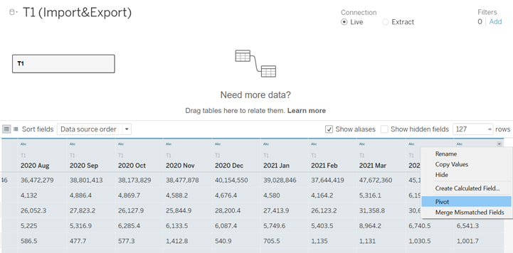

```{r setup, include=FALSE}
knitr::opts_chunk$set(echo = FALSE)
```

# 1.0 Critique of Visualisation

The original visualization can be seen below:

{width=70%}

## 1.1 Clarity

No.|Critiques| Suggestion    
---|---------|------------
 1 |**Lack a title:** this visualization does not have a title to clarify main topic. Through labels, we find this chart is trying to show information of merchandise trade, trade surplus and trade deficit about ten different market.|Add appropriate graph title
 2 |**Time period of data is unclear:** the description at the bottle of the chart said, “Since 2009, the value of exports exceeds imports for Singapore’s merchandise trade with Mainland China.” However later when describe trade deficit with the US, time become “since 2006”.  Which confuse reader with data used in this chart. Besides data used for this visualization vary from time however the original chart fail to show any information about year|Set date range from Jan 2011 to Dec 2020 and Add filters to graph let user select years.
 3 |**Axis variables is unclear:** Axis and labels on the plot is hard to understand. At the coordinate axis origin, we can find two icon show “Import” and “Export”. However, at the end of each axis we can also find “Net Import” and “Net Export” This confuses reader which variables axis want to show.  Besides axis variables have no units. Reader not sure is “80” stand for percentage or numerical value.|Label Axis with percentile of Import/Export change Net Import/Export to Trade Surplus/Deficit.
 
## 1.2 Aesthetic

No.|Critiques| Suggestion    
---|---------|------------
 1 |**Too much information in one chart design blurred main subjects:** The design using colour to highlight country, net import and export, also using icon to mark the countries with top trade surplus and deficit. There are too many factors blurred main subjects.|Separate original graph into three parts: bubble plot, bar chart, and ranking plot.
 2 |**Design hard to read:** This chart using position of the center point of each bubble, the white cycle in the bubble, to show whether the country have trade surplus or trade deficit. The white point is small and the note that explain how to read this design is also in a relatively smaller font size. Reader may not pay attention to it unless carefully read the whole chart.|Keep original bubble plot and diagonal reference line. In the new design, we use the position of bubble inside of centre points to show the relationships between import and export value. For the country close or on the reference line. We add another bar chart to provide additional information. The bar chart will show monthly balance of trade. User can also filter country by click on the bubble.
 3 |The bubbles overlap on each other, which makes reader hard to find the center point for some regions such as Republic of Korea and EU.|Edit percentage of opacity in Tableau can help overcome this problem.
 
# 2.0 Alternative Design
{width=60%}

# 3.0 Proposed Visualization
Please view the visualization on Tableau Public [here](https://public.tableau.com/app/profile/qinyu.wang/viz/Makeover2_16241930132380/Dashboard1)

## 3.1 Data Preparation

1. We notice this dataset are in report format inside of a tidy format for analysis. Hence, using MS Excel delete description at the front of each sheet. Then Open Tableau, drag and drop Ms excel file in. 

2.Povite Dataset: Select all date column, click the black triangle, then choose “Pivot”. To pivot the sheet into a longer format. Next, double click the title, rename pivot column into “Time” “import” and “country”.

{width=60%}

{width=60%}

3. Change Time into Date format and Export to Number(whole)

{width=60%}

4. Add filter: Add two filter conditions. Click the “Edit”, first filter the countries we used for this visual analysis. Second range date from 1/1/2011 to 1/12/2020.

{width=60%}

5. Adjust unit of European Union: First using Customer Split function, Split Country name into one column. Separator as “(“ . 

{width=60%}

{width=60%}

Next, we add calculation column using function below, Through this step, Transfer European Union’s unit from Million Dollars to Thousand Dollars.

{width=60%}

Do the same cleaning steps for T2, then export T1 and T2 to “.csv” files. Rename T1 as “Import.csv” and T2 as “Export.csv”

5. Combine two tables: Open another Tableau book. Drag the CSV files in. Using Inner Join function merge two files.

{width=60%}

## 3.2 Data Visualization

1. Add Balance of Trade: add calculation columns using functions below:

{width=60%}

2. build basic bubble plot: Drag and drop Import and Export into Rows and Columns. Select” Country” as detail. For a clear visualization, we transfer both “Import” and “Export” into percentile calculated by country. Click the triangle on the node, select “Quick table calculation-percentile”. Next at the same menu choose “computing using-country”.

{width=60%}

{width=60%}

3. Add Diagonal Reference Line:  Drag and drop another “import” to Columns, do the same transformation as previous step.  The chart should look as below:

{width=60%}

Next, click the triangle on our new “Import” node, choose “Dual Axis”. Hold mouse near the reference line spot, right click, choose” Trend Line-Show Trend Line”. Next,under SUM(Import), adjust” Size” to smallest. “Color” to “opacity” to 0 and “border” to none.

{width=60%}

Right click Axis on the top, uncheck ”show Header” 

{width=60%}

Right click x-Axis check “synchronize Axis”

{width=60%}

The finished plot shows below, reference line separates the whole plot into two parts, the part above reference line means Import over Export and below means Export over Import. Add two Annotates to show the area of Trade Surplus and Trade Deficit.  However, the data we used are vary from time. Hence, next we should add “Time” as filter.

{width=60%}

4. Add filter:  Drag “Time” to Filter, adjust setting choose “Single Value (slider)”

{width=60%}

5. Drag country to color. Add Annotates “Trade Deficit” put it upper left ,change color to red and “Trade Surplus” at bottom right and change color to blue. 

6. click” Label”. Change Direction of label from Automatic to vertical.

{width=60%}

7. right click on X and Y Axis. Choose Edit Axis. Adjust them to fix range from 0 to 1.0

{width=60%}

8. Edit Tooltip:

{width=60%}

the bubble plot can only give a general information about each country. Hence, add bar chart to show more detail information. 

9. Select “Country” and “MONTH(Time)” as Columns. Drag two Balance of Trade into Rows.

{width=60%}

Next edit Axis, let two balance of Trade show positive and negative value respectively. Rename positive part as “surplus” and negative part as “deficit”.

{width=60%}

{width=60%}

Using the same method add filter bar of time and country. Drag Balance of Trade to color. Edit color to red and blue. Fix start and end value.

{width=60%}

{width=60%}

10. Add ranking graph for annual import and export. Drag Country and Export to Rows and Columns. Click triangle behand country. Sort by Nested. Drag Export to color and edit color to same color as surplus. Add title and insert Year to title. 
Duplicate sheet for Import.

{width=60%}

{width=60%}

Create Dashboard

1. Drag four sheets into Dashboard. Adjust position.

2. Create filter action: when user click the country bubbles on bubble plot. Monthly bar chart plot filter by country which select. Under Dashboard menu, find action, choose add action-filter.

{width=60%}

{width=60%}

3. Adjust filter bar on the right: on dashboard, left one filter bar for time and one for country. To achieve this, first, delete extra filters. Next go to bubble plot sheet. for time, click the triangle, find apply to worksheet change to all using this data source. For country, at the same place, choose selected worksheets, then choose bar chart.

{width=60%}

4. Add title, data source and description.

5. Turn on Animations setting: under format menu, click Animations. Default as “off” Turn on the rest as default setting. This step for smoother change when change from different years.

{width=60%}

# 5.0 Derived Insights

1. Overall for export, Malaysia, Mainland China, and Hong Kong are major export market and Mainland China, Malaysia, European Union are major import markets 

2. From 2011 to 2020, Hong Kong, Indonesia, and Thailand are countries with trade surplus. Balance of Trade maintain positive. Hong Kong has the highest trade surplus value from 2011 to 2020 and remain stable. Indonesia rank second. However, we can observe a decreasing trend of balance of trade with Indonesia. 

3. European Union, Japan and United State are countries with trade deficit. From 2011 to 2009, those country maintain a negative balance of trade.

4. For Japan, Mainland China, Republic of Korea and Malaysia, before 2018 they show clear trade surplus or deficit. Since 2018, Trade with this group gradually approaching trade balance.

5. We observed some unusual insights in 2020. The annual import from Taiwan increased significantly and rank third large import market in 2020. Export from US also extremely increased at the second half of 2020 which turn a decade trade deficit to trade surplus.

