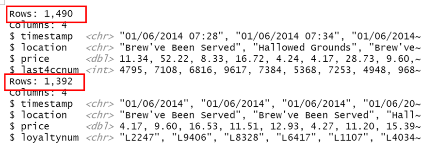
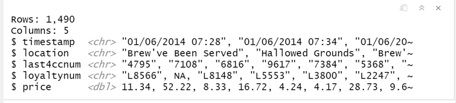
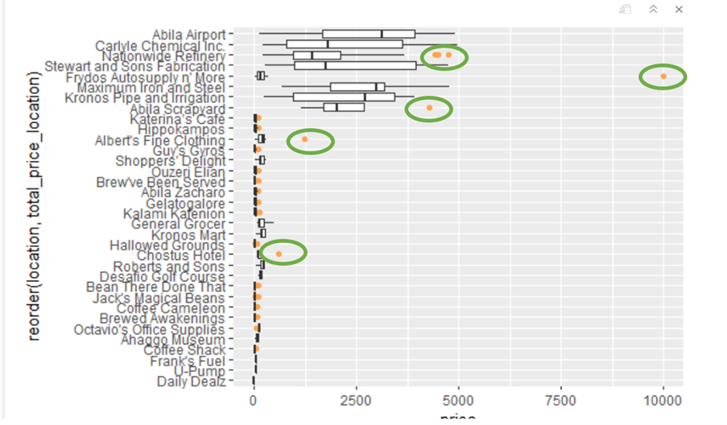
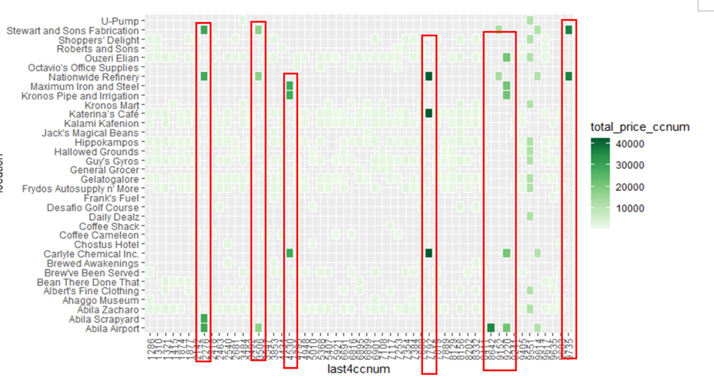
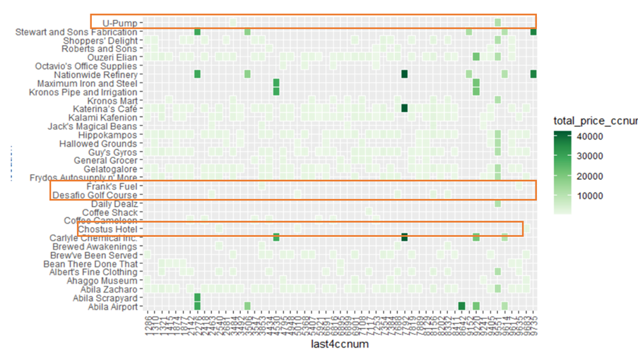
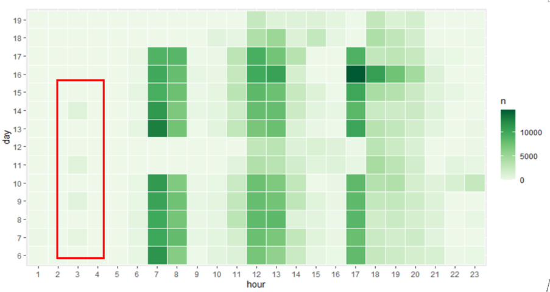
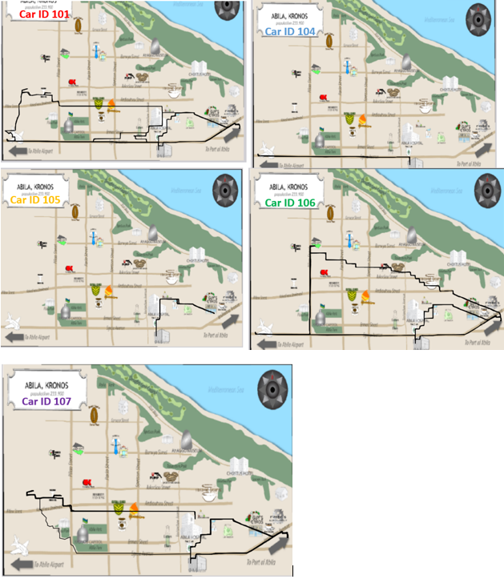
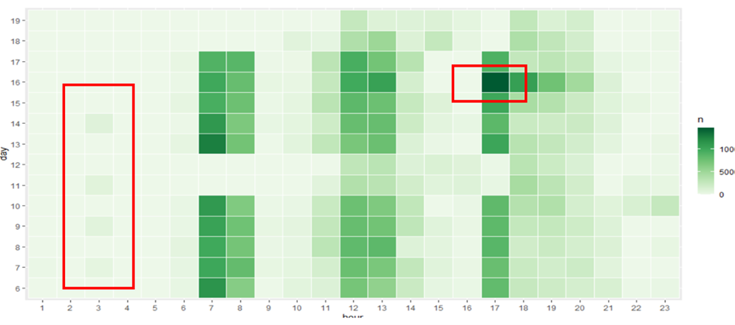
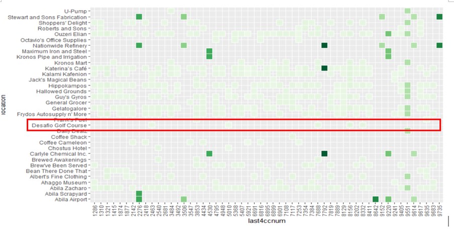

```{r setup, include=FALSE}
knitr::opts_chunk$set(echo = TRUE,
                      fig.retina = 3,
                      eval = TRUE,
                      message = FALSE,
                      warning = FALSE)
```

# 1.BACKGROUND
In January 2014, the leaders of GAStech are celebrating their new-found fortune as a result of the initial public offering of their very successful company. In the midst of this celebration, several employees of GAStech go missing.

In Mini-Challenge 2,I will analysis GAStech’s company cars gps records, credit card transactions and loyalty card usage data. From this data, I will identify anomalies and suspicious behaviors and identify which people use which credit and loyalty cards. All questions will be responsed by using visual analysis.

# 2.LITERATURE REVIEW

The same dataset have been used in [2014 VAST Challenge](https://www.cs.umd.edu/hcil/varepository/VAST%20Challenge%202014/challenges/MC2%20-%20Patterns%20of%20Life%20Analysis/). Previous works on this dataset inspire a lot in this assignment. Many groups using heatmap to show the relationship of location, date, time etc. 
[Central South University Group](https://www.cs.umd.edu/hcil/varepository/VAST%20Challenge%202014/challenges/MC2%20-%20Patterns%20of%20Life%20Analysis/entries/Central%20South%20University/) Separate locations into different groups make the most popular location more meaningful. They also break gps data into different time period is also make gps path clearer. [UWB-Smith-MC2](https://www.cs.umd.edu/hcil/varepository/VAST%20Challenge%202014/challenges/MC2%20-%20Patterns%20of%20Life%20Analysis/entries/University%20of%20Buenos%20Aires%20-%20Croceri/)focused on business relative area and also break time into four period. 
for the map and gps data, I refer to Dr.Kam Tin Seong's courseware of [ISSS608 Visual Analytics and Applications](https://isss608.netlify.app/)

# 3. METHODOLOGY & DATA PREPARATION

The packages using for this Assignment shows below:

No.|Packages |Function
---|---------|---------
1  |tidyverse|Data cleaning and manipulation.
2  |ggplot2  |ggplot2 is a system for declaratively creating graphics.
3  |ggiraph  |ggiraph is a tool that allows you to create dynamic ggplot graphs.
4  |lubridate,clock |For clear and manipulate date.
5  |tmap,raster,mapview,sf|For geographical data.


## 3.1 Library Packages
```{r}
packages = c('tmap', 'clock', 
             'tidyverse','ggplot2','ggiraph',
             'lubridate','ggthemes','viridis','plotly','treemapify','sf',
             'raster','readr','mapview'
             )
for (p in packages){
  if(!require(p, character.only = T)){
    install.packages(p)
  }
  library(p,character.only = T)
}
```

## 3.2 Import data

```{r}
cc_data<- read.csv('D:/ISSS608 Data Visualization/MC2/MC2/cc_data.csv')

loyalty_data <- read.csv('D:/ISSS608 Data Visualization/MC2/MC2/loyalty_data.csv')

car <- read_csv('D:/ISSS608 Data Visualization/MC2/MC2/gps.csv')

glimpse(cc_data)
glimpse(loyalty_data)
```

## 3.3 Data Preparation

Before any analysis, we first prepared cc_data and loyalty card. We find timestamp is treated as "Character"" data type instead of date data type. We correct this by using lubridate package. Then separate timestamp into day, weekday for further analysis. Change the “Last4num” datatype from int to chr. Then calculate the total price by location, card number ,card number and locations, respectively.

```{r}
cc_data$dmy_hm <- date_time_parse(cc_data$timestamp,
                zone = "",
                format = "%m/%d/%Y %H:%M")

cc_data$weekday <- wday(cc_data$dmy_hm, 
                             label = TRUE, 
                             abbr = FALSE)

cc_data$hour <- hour(cc_data$dmy_hm)

cc_data$day <- day(cc_data$dmy_hm)

cc_data$last4ccnum <- as.character(cc_data$last4ccnum)

cc_data <- cc_data %>% 
  group_by(location) %>% 
  mutate(total_price_location = sum(price)) %>% 
  ungroup()

cc_data <- cc_data %>% 
  group_by(last4ccnum,location) %>% 
  mutate(total_price_loccnum = sum(price)) %>% 
  ungroup()

cc_data <- cc_data %>% 
  group_by(last4ccnum) %>% 
  mutate(total_price_ccnum = sum(price)) %>% 
  ungroup()


loyalty_data$dmy<- date_time_parse(loyalty_data$timestamp,
                zone = "",
                format = "%m/%d/%Y")

loyalty_data$weekday <- wday(loyalty_data$dmy, 
                             label = TRUE, 
                             abbr = FALSE)

loyalty_data$day <- day(loyalty_data$dmy)

loyalty_data <- loyalty_data %>% 
  group_by(location) %>% 
  mutate(total_price_location = sum(price)) %>% 
  ungroup()

loyalty_data <- loyalty_data %>% 
  group_by(loyaltynum,location) %>% 
  mutate(total_price_lolynum = sum(price)) %>% 
  ungroup()

loyalty_data <- loyalty_data %>% 
  group_by(loyaltynum) %>% 
  mutate(total_price_lynum = sum(price)) %>% 
  ungroup()

car$dmy_hm <- date_time_parse(car$Timestamp,
                zone = "",
                format = "%m/%d/%Y %H:%M:%S")

car$day <- day(car$dmy_hm)

car$hour <- hour(car$dmy_hm)

```

# 4. INSIGHTS

## 4.1 Question 1

First, I look at cc card and loyalty card separately. For all location, I segment them into four groups: Business Dinning Living and Unknown. Through this bar chart, I observed that the most popular place for each group is Katerina’s Café, Hippokampos, Abila Airport and Ouzeri Elian. Overall Katerina’s Café is the most popular place and have been visit more than 200 times. Because of the relationship between credit card and loyalty card, loyalty card records give us the same result. 

```{r}
cc_bar_chart <- cc_data %>% 
  group_by(location) %>% 
  summarise(n = n()) %>% 
  ungroup()

oldvalues <- c("Abila Airport","Abila Scrapyard","Abila Zacharo",
               "Ahaggo Museum","Albert's Fine Clothing",
                "Bean There Done That","Brew've Been Served",
               "Brewed Awakenings","Carlyle Chemical Inc.",
               "Chostus Hotel","Coffee Cameleon","Coffee Shack",
               "Desafio Golf Course","Frank's Fuel",
               "Frydos Autosupply n' More","Gelatogalore",
               "General Grocer","Guy's Gyros","Hallowed Grounds",
               "Hippokampos","Jack's Magical Beans","Kalami Kafenion",
               "Katerina’s Café","Kronos Mart","Kronos Pipe and Irrigation",
               "Maximum Iron and Steel","Nationwide Refinery",
               "Octavio's Office Supplies","Ouzeri Elian",
               "Roberts and Sons","Shoppers' Delight",
               "Stewart and Sons Fabrication","U-Pump")
newvalues <- factor(c("Business","Business","Unknown",
                      "Living","Living","Unknown","Dinning",
                      "Unknown","Business","Living","Dinning",
                      "Dinning","Living","Unknown","Unknown",
                      "Dinning","Living","Dinning","Dinning",
                      "Living","Living","Unknown","Dinning",
                      "Living","Business","Business","Business",
                      "Business","Unknown","Business","Living",
                      "Business","Unknown"
                      ))  # Make this a factor

cc_bar_chart$type <- newvalues[ match(cc_bar_chart$location, oldvalues) ]


p <- ggplot(cc_bar_chart,aes(x = reorder(location,-n), 
                             y = n,fill = type)) + 
  geom_col(color="black") + 
  theme(axis.text.x = element_text(angle = 90, 
                                   hjust = 1, 
                                   vjust = .5))

p <- p + ggtitle("Frequnecy of Credit Card by Location") + 
        labs(y="Frequency", x = "Location")

ggplotly(p)

```

Then I plot heatmaps by weekday and hour of each day for the most popular location. Abila Airport’s records mainly in workday between 8:00 to 16:00. Th popular time of Katerina’s Café and Hippokampos in 12:00 to 13:00 and 18:00 and 20:00. Those are the time period when employee have their lunch break or off office.The most popular time for Abila Zacharo is 12:00-13:00.

```{r}
plot <- cc_data%>% 
  group_by(location,weekday,hour,) %>% 
  summarise(n = n()) %>% 
  ungroup() 

full_df <- expand.grid(location = unique(cc_data$location),
                       weekday = unique(cc_data$weekday),
                       hour = c(1:23))

plot_full <- plot %>% 
  right_join(
    full_df,
    by = c('location','weekday','hour') 
  ) %>% 
  mutate(hour = as.ordered(hour)) %>% 
  replace_na(list(n = 0L)) %>% 
  filter(location %in% c("Katerina’s Café","Hippokampos",
                          "Abila Airport","Abila Zacharo"))


pwk<- ggplot(plot_full, aes(hour, weekday, fill = n)) + 
geom_tile(color = 'white',size = 0.1) + 
  facet_grid(~location) +
   scale_fill_distiller(palette = "Reds",direction = 1)
pwk
```

### 4.1.1 Anomalies-1

One Anomaly is credit card record and loyalty card record not match. According to the background information, loyalty cards records are collecting from employee’s credit card purchases and preferences records. Loyalty card records should match credit card records. However, cc_data has total 1490 rows and loyalty_data only include 1392 rows. This phenomenon hints us for some transaction, customer didn’t use loyalty card for discounts and rewards. Further dig the data, we also find, on the opposite, some customer using loyalty card but didn’t have credit card records. This kind of record happened in Stewart and Sons Fabrication and Carlyle Chemical Inc. One possible reason is those transaction is not paid by credit card. 



One way to correct this is to find a whole transaction records by join cc_data and loyalty_data on Location, Price and Date. Because timestamp in cc_data have detailed time when transaction happened, some records happened in same location, price and data may have error. After manual remove the mismatched information, I get a new dataset include 1490 rows. 




### 4.1.2 Anomalies-2

The box plot blow shows us several information. First, Top locations of total transaction price are business relative place or company. Second, some locations have transaction records extremely higher than normal. 

```{r}
ggplot(cc_data, aes(x=price, y=reorder(location,total_price_location))) + 
  geom_boxplot(outlier.colour="tan1")
```

Dig deeper into those transaction’s card number and price spend. I find some suspicious phenomenon:



**9551 13th $10000** Extremely large amount of purchase compare with other purchase records happened in Frydos Autosupply n' More and 9551’s other transaction. This is the only record for 9551 in this location. 

**5010 18th $600** Extremely large amount of purchase compare with other purchase records happened in Chostus Hotel. This is the only record for 5010 in this location.Date is close to when kidnap happened.

**1321 17th $1239** Extremely large amount of purchase compare with other purchase records happened in Albert's Fine Clothing and 1321’s other transaction. This is the only record for 1321 in this location. Date is close to when kidnap happened.

Below heatmap shows total transaction price by location by credit card number. 

```{r}
ggplot(cc_data,aes(x = last4ccnum,y = location,fill = total_price_ccnum))+
  geom_tile(color = 'white',size = 0.1)+
  scale_fill_distiller(palette = "Green",direction = 1)+
  theme(axis.text.x = element_text(angle = 90, 
                                   hjust = 1, 
                                   vjust = .5))
```

I observed that five card number’s transaction records are very clear. They only make transaction in business related location and usually large amount of money. Hence,I infer those cards belongs to Truck Drivers.



Besides, there are some location have relative less unique customer visit, this can be another point lead me find card owner.




Next step, I will add gps data in further explore the suspicious phenomenon and find the owner of credit card.


## 4.2 Question 2 & 3

In this step, I input map and clear the noise gps data. Group gps data by CarID, day and hour, then combine cc_card transaction information and car moving route to locate owner of card and activities they may involve in. 

```{r}
bgmap <- raster('D:/ISSS608 Data Visualization/MC2/MC2/Geospatial/MC2-tourist.tif')

tmap_mode('plot')
tm_shape(bgmap) +
  tm_raster(bgmap,
            legend.show = FALSE)

tmap_mode('view')
tm_shape(bgmap) +
  tm_rgb(bgmap, r = 1,g = 2,b = 3,
         alpha = NA,
         saturation = 1,
         interpolate = TRUE,
         max.value = 255)
        
Ablia_st <- st_read(dsn = "D:/ISSS608 Data Visualization/MC2/MC2/Geospatial",
                    layer = 'Abila')

gps <- read_csv("D:/ISSS608 Data Visualization/MC2/MC2/gps.csv")
glimpse(gps)


gps$Timestamp <- date_time_parse(gps$Timestamp,
                zone = "",
                format = "%m/%d/%Y %H:%M:%S")
gps$day <- as.factor(get_day(gps$Timestamp))

gps$id <- as_factor(gps$id)

gps$hour <- as.factor(get_hour(gps$Timestamp))

gps_sf <- st_as_sf(gps,
                   coords = c("long","lat"),
                   crs = 4326)

```

```{r}
gps_path <- gps_sf %>%
  group_by(id, day, hour) %>%
  summarize(m = mean(Timestamp), 
            do_union=FALSE) %>%
  st_cast("LINESTRING")

p = npts(gps_path, by_feature = TRUE)
gps_path2 <- cbind(gps_path, p)

gps_path <- gps_path2 %>%
  filter(p > 1)
```  

Looking at gps data only, first I find the rush period is Mon-Fri morning 7:00 to 8:00, Noon 12:00 to 13:00 and afternoon 17:00 to 18:00. 

```{r}
car_data <- car %>% 
  group_by(day,hour) %>% 
  summarise(n = n()) %>% 
  ungroup() 

full_df_car <- expand.grid(day = unique(car$day),
                          hour = c(1:23))

plot_full_car <- car_data %>% 
  right_join(
    full_df_car,
    by = c('day','hour') 
  ) %>% 
  mutate(hour = as.ordered(hour)) %>% 
  mutate(day = as.ordered(day)) %>% 
  replace_na(list(n = 0L)) 

ggplot(plot_full_car, aes(hour,day,fill = n)) + 
geom_tile(color = 'white',size = 0.1) + 
   scale_fill_distiller(palette = "Green",direction = 1)

```

I also find there are unusual gps records at 3am in 7th ,9th ,11th and 14th. 



### 4.2.1 Truck Drivers 

Compare the gps path with credit card transaction records showed before. I infer the owner of credit card and loyalty card:

CarID|Credit Card|Loyalty Card
-----|-----------|-------------
101  |   9220    |   L4063
104  |   8642    |   L2769
105  |   7792    |   L5756
106  |   2276    |   L3317
107  |   4530    |   L8477


```{r}
gps_path_101 <- gps_path %>% 
  filter(id == 107)

tmap_mode("view")
tm_shape(bgmap) +
  tm_rgb(bgmap, r = 1,g = 2,b = 3,
         alpha = NA,
         saturation = 1,
         interpolate = TRUE,
         max.value = 255) +
  tm_shape(gps_path_101) + tm_lines()
```

### 4.2.3 Movement at 3am
All the movement at 3am are belong to Security department and they are Bodrogi Loreto(15), Mies Minke(24), Osvaldo Hennie(16), Osvaldo Hennie(21). This make this sign more suspicious.




#### CarID:15  Date:7th and 9th
CarID 15 Bodrogi Loreto from last record on 6th is at 17:00 from GAScompany to home. However, He move at next 3am to near Speston Park and stay there for whole night then directly went to work next day. Similar path in 9th 3am, he went to place near Taxiarchan Park.


```{r}
gps_path_150617 <- gps_path %>% 
  filter(id == 15,day == 6,hour ==17)

tmap_mode("view")
tm_shape(bgmap) +
  tm_rgb(bgmap, r = 1,g = 2,b = 3,
         alpha = NA,
         saturation = 1,
         interpolate = TRUE,
         max.value = 255) +
  tm_shape(gps_path_150617) + tm_lines()
```

```{r}
gps_path_150703 <- gps_path %>% 
  filter(id == 15,day == 7,hour ==3)

tmap_mode("view")
tm_shape(bgmap) +
  tm_rgb(bgmap, r = 1,g = 2,b = 3,
         alpha = NA,
         saturation = 1,
         interpolate = TRUE,
         max.value = 255) +
  tm_shape(gps_path_150703) + tm_lines()
```


```{r}
gps_path_150707 <- gps_path %>% 
  filter(id == 15,day == 7,hour %in% c(7,8))

tmap_mode("view")
tm_shape(bgmap) +
  tm_rgb(bgmap, r = 1,g = 2,b = 3,
         alpha = NA,
         saturation = 1,
         interpolate = TRUE,
         max.value = 255) +
  tm_shape(gps_path_150707) + tm_lines()
```

```{r}
 gps_path_150903 <- gps_path %>% 
  filter(id == 15,day == 9,hour == 3)

tmap_mode("view")
tm_shape(bgmap) +
  tm_rgb(bgmap, r = 1,g = 2,b = 3,
         alpha = NA,
         saturation = 1,
         interpolate = TRUE,
         max.value = 255) +
  tm_shape(gps_path_150903) + tm_lines()
```

#### CarID 24 Date:9th

Mies Minke(24) also have movement in 9th and we find he went to same place near Taxiarchan Park as CarID 15. Hence, there is a high possibility they meet secretly.

```{r}
gps_path_240903 <- gps_path %>% 
  filter(id == 24,day == 9,hour == 3)

tmap_mode("view")
tm_shape(bgmap) +
  tm_rgb(bgmap, r = 1,g = 2,b = 3,
         alpha = NA,
         saturation = 1,
         interpolate = TRUE,
         max.value = 255) +
  tm_shape(gps_path_240903) + tm_lines()
```

#### CarID 16 and 21 Date:11th 

Vann Isia(16) and Osvaldo Hennie(21) met in 11th midnight. the activity this similar to what happened with Bodrogi Loreto and Mies Minke. We have reason to doubt Security Department's Perimeter Controls were planning something.

Osvaldo Hennie(21) left until 11:00 next day and we miss the data Vann Isia(16)'s gps data from 3:00 to 18:00. Hence, we cannot located where she might go. 

```{r}
gps_path_161103 <- gps_path %>% 
  filter(id == 16,day == 11,hour == 3)

tmap_mode("view")
tm_shape(bgmap) +
  tm_rgb(bgmap, r = 1,g = 2,b = 3,
         alpha = NA,
         saturation = 1,
         interpolate = TRUE,
         max.value = 255) +
  tm_shape(gps_path_161103) + tm_lines()
```

```{r}
gps_path_211103 <- gps_path %>% 
  filter(id == 21,day == 11,hour %in% c(3,11))

tmap_mode("view")
tm_shape(bgmap) +
  tm_rgb(bgmap, r = 1,g = 2,b = 3,
         alpha = NA,
         saturation = 1,
         interpolate = TRUE,
         max.value = 255) +
  tm_shape(gps_path_211103) + tm_lines()
```

#### CarID 21 and 24 Date:14th 

Osvaldo Hennie(21) have same path like 11th went to temple at 3:00 and this time met with Mies Minke(24)

```{r}
gps_path_211403 <- gps_path %>% 
  filter(id == 24,day == 14,hour %in% c(3))

tmap_mode("view")
tm_shape(bgmap) +
  tm_rgb(bgmap, r = 1,g = 2,b = 3,
         alpha = NA,
         saturation = 1,
         interpolate = TRUE,
         max.value = 255) +
  tm_shape(gps_path_211403) + tm_lines()
```

In the conclusion, We have reason to doubt Security Department's Perimeter Controls were planning something. Bodrogi Loreto(15), Mies Minke(24), Osvaldo Hennie(16), Osvaldo Hennie(21) all have path met near temple and stay for whole night.

### 4.2.2 Executive's Golf Meet

From the heatmap, I find only six persons have transaction record in Desafio Golf Course. I guess those are GAS’s Executives. Executives are important for this event and there are hight possibility they meet each other regularly at Desafio Golf Course. Hence, I will dig deep in Executives gps path.




#### CarID 31 Sanjorge Jr. Sten President/CEO

I only have three days gps data of CEO. He has a simple life and seems stay in hotel. He went out for work at 17th and 18th noon go out for lunch. Then 19th went to golf course. The map shows gps path of CarID 31 in 19th

```{r}
gps_path_3119 <- gps_path %>% 
  filter(id == 31,day == 19)

tmap_mode("view")
tm_shape(bgmap) +
  tm_rgb(bgmap, r = 1,g = 2,b = 3,
         alpha = NA,
         saturation = 1,
         interpolate = TRUE,
         max.value = 255) +
  tm_shape(gps_path_3119) + tm_lines()
```

#### CarID 32 Strum Orhan SVP/COO

Strum Orhan’s path is simple too. During 19th, he went to golf course and went to shopping then went home. Hence, we basically located GAS’s Executives have a golf meet in 19th is worth noting that his home is near Taxiarchan Park where Security always went at midnight. It might have some relation between these two signs

```{r}
gps_path_3219 <- gps_path %>% 
  filter(id == 32,day == 19,hour %in% c(12,18,20))

tmap_mode("view")
tm_shape(bgmap) +
  tm_rgb(bgmap, r = 1,g = 2,b = 3,
         alpha = NA,
         saturation = 1,
         interpolate = TRUE,
         max.value = 255) +
  tm_shape(gps_path_3219) + tm_lines()
```

#### CarID 35 Vasco-Pais Willem Environmental Safety Advisor

From background information, we know that GAStech has not been as successful in demonstrating environmental stewardship. So Vasco-Pais Willem as Environmental Safety Advisor is important. From his gps path, we find he stay near temple, which is the meet place where Osvaldo Hennie(21) met with Mies Minke(24) at 3:00am in 14th.

```{r}
gps_path_35 <- gps_path %>% 
  filter(id == 35,day == 19,hour == 12)

tmap_mode("view")
tm_shape(bgmap) +
  tm_rgb(bgmap, r = 1,g = 2,b = 3,
         alpha = NA,
         saturation = 1,
         interpolate = TRUE,
         max.value = 255) +
  tm_shape(gps_path_35) + tm_lines()
```

#### CarID 10 Campo-Corrente Ada SVP/CIO

Once again, we find where Campo-Corrente Ada(10) stay is the place where Bodrogi Loreto(15) went at 3:00am in 7th and 9th.

```{r}
gps_path_10 <- gps_path %>% 
  filter(id == 10,day == 19,hour == 19)

tmap_mode("view")
tm_shape(bgmap) +
  tm_rgb(bgmap, r = 1,g = 2,b = 3,
         alpha = NA,
         saturation = 1,
         interpolate = TRUE,
         max.value = 255) +
  tm_shape(gps_path_10) + tm_lines()
```

#### CarID 4 Barranco Ingrid SVP/CFO

```{r}
gps_path_04 <- gps_path %>% 
  filter(id == 4,day == 19)

tmap_mode("view")
tm_shape(bgmap) +
  tm_rgb(bgmap, r = 1,g = 2,b = 3,
         alpha = NA,
         saturation = 1,
         interpolate = TRUE,
         max.value = 255) +
  tm_shape(gps_path_04) + tm_lines()
```

In the conlusion, GAStech's Executives have a golf meet in 19th from 12:00 to 16:00. And Midnight meeting of Security person may be monitor GAStech's Executives.

Based on the daily gps path and credit card transaction records, I infer the cards of Executives shows below:


